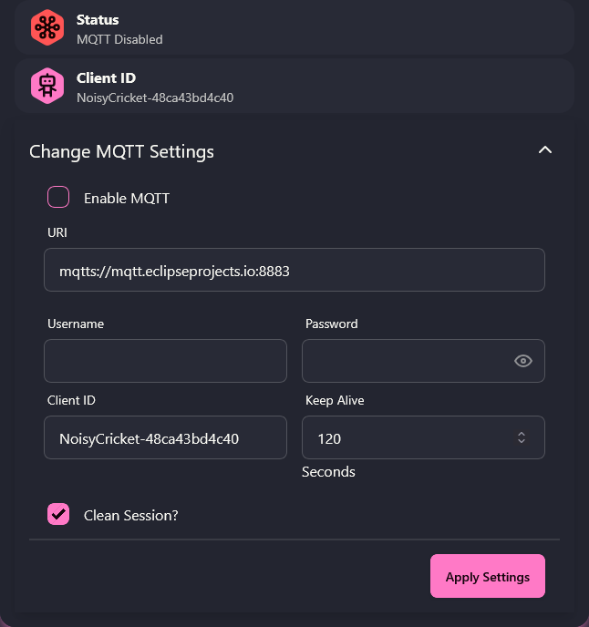

# Connectivity

Noisy Cricket has several ways to control it remotely. One may either use MQTT messages, websockets with a custom MessagePack event protocol or a RESTful API to control Noisy Cricket. However, not all API endpoints are available through all protocols. More general settings and configurations are exclusively done through REST. Typical usage controls are available through MQTT and the websocket event protocol.

## MQTT

Go to `Connections` > `MQTT` in the side menu to open the MQTT settings. THe upper sections shows the connection status and the MQTT server settings. Check the "Enable MQTT" checkbox to connect to the MQTT server. Specify the URI and port. The MQTT client supports SSL encryption and MQTT through websocket.



If a username and password are required these can be specified. As well as the Client ID, keep alive interval and wether a clean session is needed.

The lower section the various topics are specified. The client distinguishes between subscribe (Set) and publish (Status) topics.

| Parameter                       | Info                                                                                                        |
| ------------------------------- | ----------------------------------------------------------------------------------------------------------- |
| Control Status Topic            | Topic to publish changes in the [Stimulation Control](API.md#stimulation-control)                           |
| Control Set Topic               | Topic to subscribe to changes in the [Stimulation Control](API.md#stimulation-control)                      |
| Burst Set Topic                 | Topic to subscribe to [Bursts](API.md#burst-control)                                                        |
| Streaming Set Topic             | Topic to subscribe to [Pulse Streams](API.md#pulse-streaming)                                               |
| Environment Status Topic        | Topic to publish the [Environment](API.md#environment-service)                                              |
| Safestate Set Topic (Heartbeat) | Topic to publish changes in the [Safestate](API.md#safestate-service)                                       |
| Safestate Status Topic          | Topic to subscribe to changes in the [Safestate](API.md#safestate-service). This is used for the heartbeat. |
| Identification Topic            | Topic to publish [identification messages](API.md#identification-service)                                   |

The exchanged messages are JSONs and described in the [API Documentation](API.md).

### Large Party Installations & Provisioning

For large installation or party games a device must be associated with a user / player and provisioned. After the device is turned on there is a 30 seconds long time window in which a single button press sends a [identification message](API.md#identification-service) to the MQTT broker. This only works if the device is connected to a MQTT broker (status LED is green). If the identification message was send a confirmation beep is played. A server side software can use this message as a signal to associate this device with a certain user.

## Websocket / Event Protocol

Beside RESTful HTTP Endpoints and MQTT the Event Socket System provides a convenient communication path between the client and Noisy Cricket. It uses a single WebSocket connection to synchronize state and to push realtime data to the client. The client needs to subscribe to the topics he is interested. Only clients who have an active subscription will receive data. To save on bandwidth the event message is encoded as binary [MessagePack](https://msgpack.org/) instead of JSON.

The event protocol is available under the following path: `ws://192.168.1.107/ws/events`

### Message Format

The event messages exchanged between Noisy Cricket and its clients consists of an "event" head and the "data" payload. For the [Stimulation Control](API.md#stimulation-control) a message looks like this in JSON representation:

```JSON
{
  "event": "control",
  "data": {
    "enable": true,
    "voltage": 20.0,
    "sensation": 0.0,
    "speed": 0.0,
    "voltage_ramp": 60.0,
    "pattern": "waves"
  }
}
```

The "event" is the Event URL in the [API Documentation](API.md). The "data" object is the content of the JSON of an API endpoint.

### Subscription

In order to receive data and state updates through the event system the client must subscribe by sending the following message (as MessagePack):

```JSON
{
  "event": "subscribe",
  "data": "livedata"
}
```

Similarly it is possible to unsubscribe when leaving the connection:

```JSON
{
  "event": "unsubscribe",
  "data": "livedata"
}
```

In addition to the [Noisy Cricket specific APIs](API.md) further subscriptions are available from the underlying [ESP32-sveltekit](https://theelims.github.io/ESP32-sveltekit/).

| Subscription   | Description                                                 |
| -------------- | ----------------------------------------------------------- |
| `rssi`         | RSSI of the WiFi signal                                     |
| `notification` | Notifications and error messages                            |
| `analytics`    | Analytical data like free heap, flash usage and temperature |
| `battery`      | Sate of charge of the battery                               |

## RESTful API

Most stateful services are also available as REST endpoint. See the [API Documentation](API.md) for the paths and JSON messages expected.
