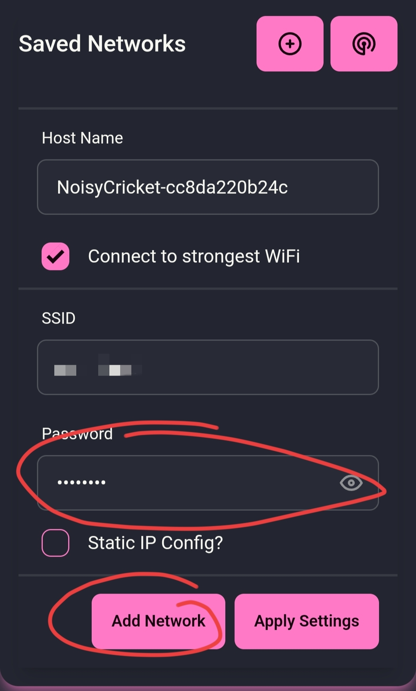

# Quickstart

## First Start

On the first start Noisy Cricket will start its own access point for WiFi provisioning. The color status LED is indicating its current connection status:

|            Status Color            | Meaning                                                |
| :--------------------------------: | ------------------------------------------------------ |
|   :material-lightbulb:{ .black}    | Device off                                             |
|  :material-lightbulb-on:{ .white}  | Device on and in offline mode                          |
|  :material-lightbulb-on:{ .blue}   | Access Point created, but no client connected          |
|  :material-lightbulb-on:{ .cyan}   | Access Point with client connected                     |
|   :material-lightbulb-on:{ .red}   | Connected to WiFi Hotspot, but no client connected     |
| :material-lightbulb-on:{ .magenta} | Connected to WiFi Hotspot and with client connected    |
|  :material-lightbulb-on:{ .green}  | Connected to WiFi Hotspot and connected to MQTT server |

## Connect to local WiFi

Ensure that the status LED is lit up in a blue color. Open your phone and search for a WLAN with an SSID starting with `NoisyCricket-` followed by an device ID. Connect to this WLAN using the following credentials:

- SSID: NoisyCricket-{DeviceID}
- Password: zapmybits

Noisy Cricket has a captive portal which your phone wants to navigate to once the WiFi connection is established.

Press on the :material-menu:-icon to open the menu and navigate to `WiFi` > `WiFi Station`.

{ width=30% }

Scan for available networks by pressing the :material-radar:-icon and select your local WiFi, or just add your credentials with the :octicons-plus-circle-16:-icon.

{ width=30% }

Fill in the password and press `Add Network` to add it to the list of known networks. You may add up to 5 networks. It will prefer the strongest WiFi, if `Connect to strongest WiFi` is enabled. Otherwise it will try to connect in the order of the WiFi list. The order of the WiFi list can be changed by drag and drop.

Finally, do not forget to upload the settings to Noisy Cricket by pressing `Apply Settings`.

## Set Timezone

While you're setting up the WiFi it is advised to also setup the local timezone. Navigate from the :material-menu:-icon to `Connections` > `NTP`.

{ width=30% }

Select your Time Zone from the last drop down menu and press `Apply Settings`.

Noisy Crickets' status LED should be red indication a connection to your local WiFi now. You can disconnect from the Access Point and navigate to its IP-address, host name or mDNS name.

## Recovery Mode

Whenever Noisy Cricket is unable to connect to a WiFi hotspot it will automatically start it's own access point. Sometimes it can be useful to force the access point to appear independent of its settings. Double press the button within 5 seconds after the device has started and it will force the access point to appear, even if it is disabled. This can be used to gain access to the device, even if the access point was disabled in the settings and it cannot connect to any WiFi station.
